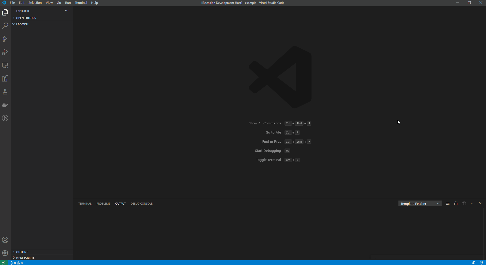
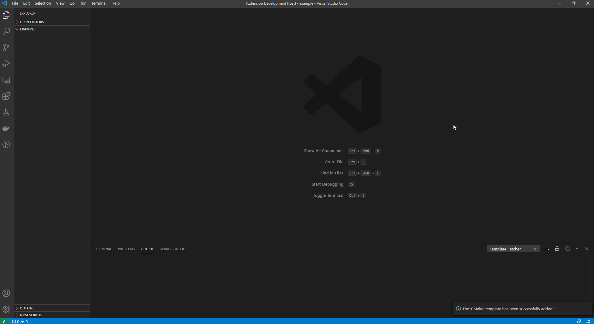

# Template Fetcher

Create template from file, directory or archive and fetch them.

## Features

### Template creation

Register templates using the `Template Fetcher: New Template` command. Following informations will be asked :

* The template name
* The kind of template it represents (a file, a directory or an archive)
* How to access it (it can be accessed from file explorer or from an URI)
* How many leading directories should be discarded when fetching (only if it is a directory or an archive)

### Template fetching

Once a template is registered, it can be fetched into a specific directory

## Extension Settings

Templates can be handwritten from user settings `templatefetcher.templates`

## Release Notes

### 0.0.1

Initial release of Template Fetcher.
New features :

* template creation
* template fetching
